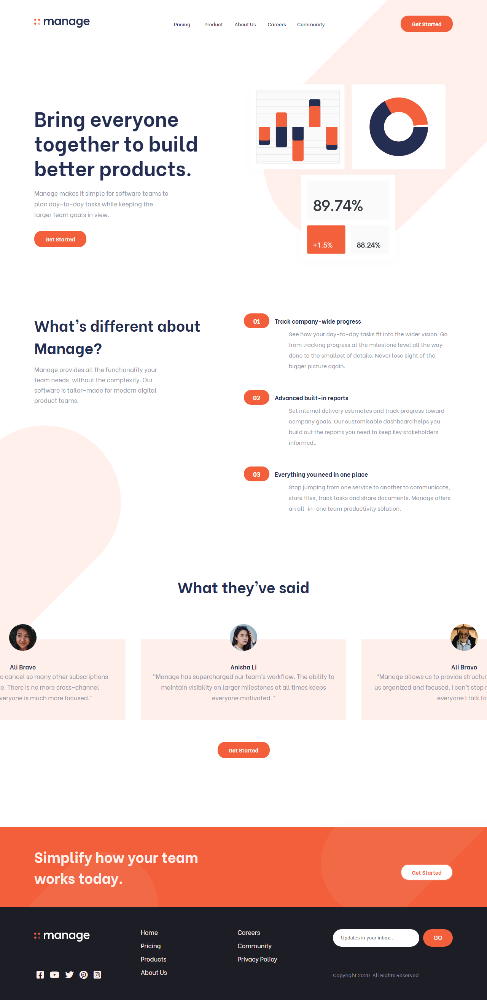

# Frontend Mentor - Manage landing page solution

### Screenshot

## Table of contents

-  [Overview](#overview)
   -  [The challenge](#the-challenge)
   -  [Screenshot](#screenshot)
   -  [Links](#links)
-  [My process](#my-process)
   -  [Built with](#built-with)
   -  [What I learned](#what-i-learned)
-  [Author](#author)

## Overview

### The challenge

Users should be able to:

-  View the optimal layout for the site depending on their device's screen size
-  See hover states for all interactive elements on the page
-  Receive an error message when the newsletter sign up `form` is submitted if:
   -  The `input` field is empty
   -  The email address is not formatted correctly

### Links

-  Solution URL: [Solution Link](https://github.com/benjoquilario/fem-manage-landing-page)
-  Live Site URL: [live Link](https://fem-manage-landing-page-benjoquilario.vercel.app/)

## My process

### Built with

-  Semantic HTML5 markup
-  CSS custom properties
-  Flexbox
-  CSS Grid
-  Mobile-first workflow
-  Gulp
-  SCSS
-  Vanilla JavaScript
-  Intersection Observer API

### Features

-  User will only be able to swipe the testimonial with `Arrow Left`,`Arrow Right`, `A` and `D` keyboard to swipe the testimonial.
-  At first I want to use the `swiper js` for the testimonial swipe, but then again I want to learn more about JavaScript without using a library.
-  Added a touchevent `touchstart` event with specific when the user touch the left screen of testimonial it will swipe to left side and vise-versa.
-  Added a `Escape` and `touch overlay` to exit the hamburger menu.
-  First time using with Intersection Observer API, this API is detecting if an object has entered the viewport. When the user will not able to see the hero section the header will become sticky on top of the screen.

### What I learned

I learned how to used Intersection Observer API and I've got a idea of how to use the touches screen with touchestart event, not really a master but I got a idea

### Useful resources

-  [Touch Event Link](https://flaviocopes.com/touch-events/) - This helped me for XYZ reason. I really liked this pattern and will use it going forward.

## Author

-  Website - [Benjo Quilario](https://portfolio-sigma-ten-27.vercel.app/)
-  Frontend Mentor - [@benjoquilari](https://www.frontendmentor.io/profile/benjoquilario)
-  Twitter - [@iam_benjo](https://twitter.com/iam_benjo)
